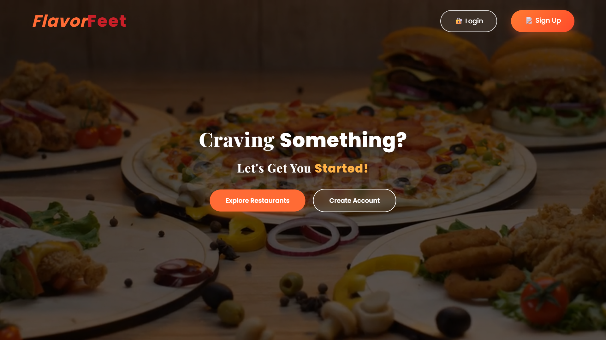
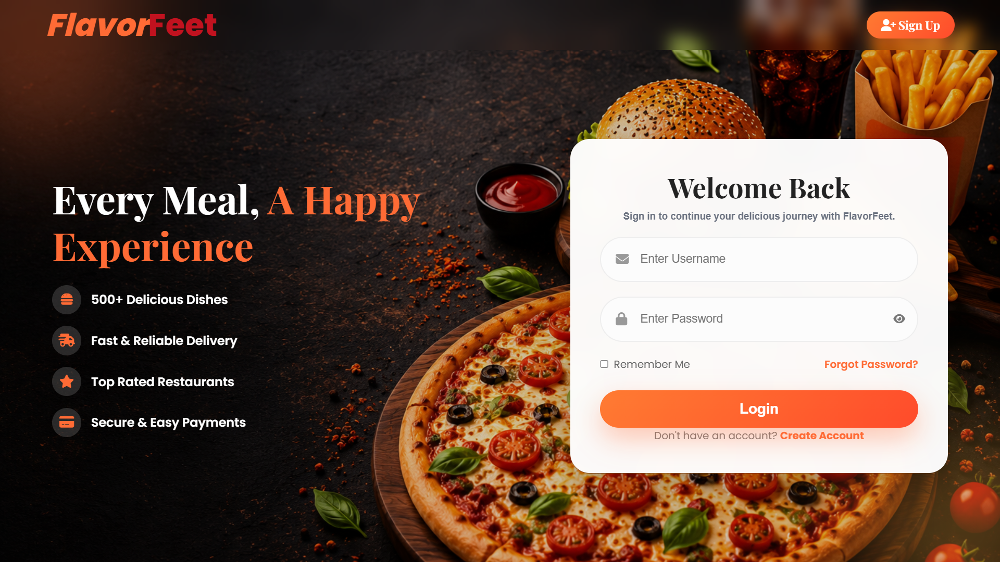
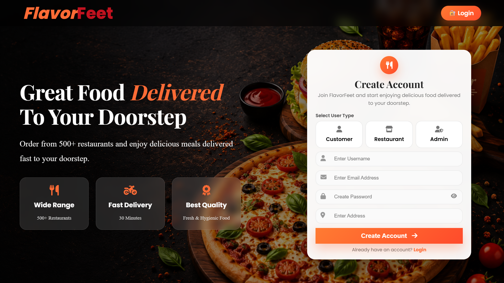
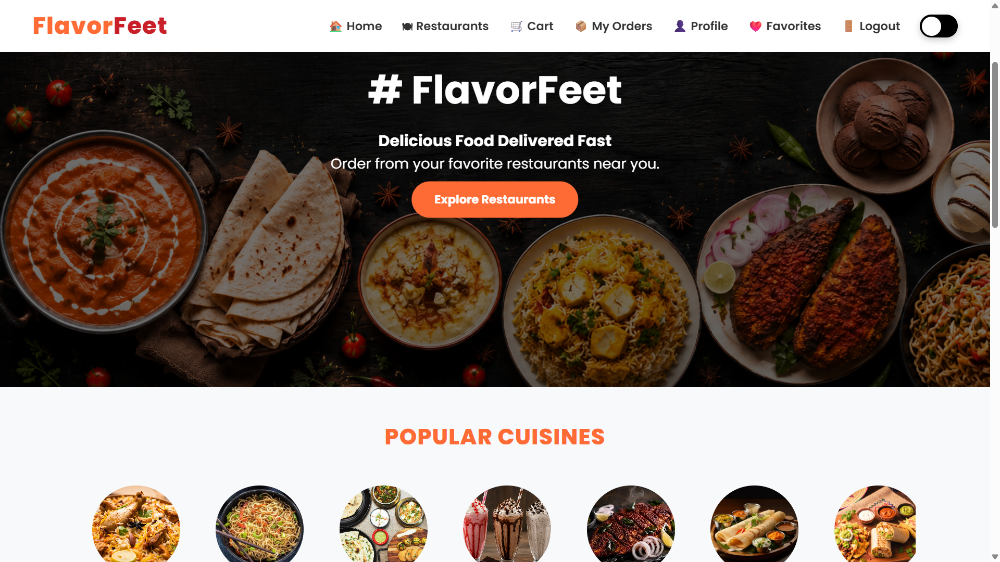
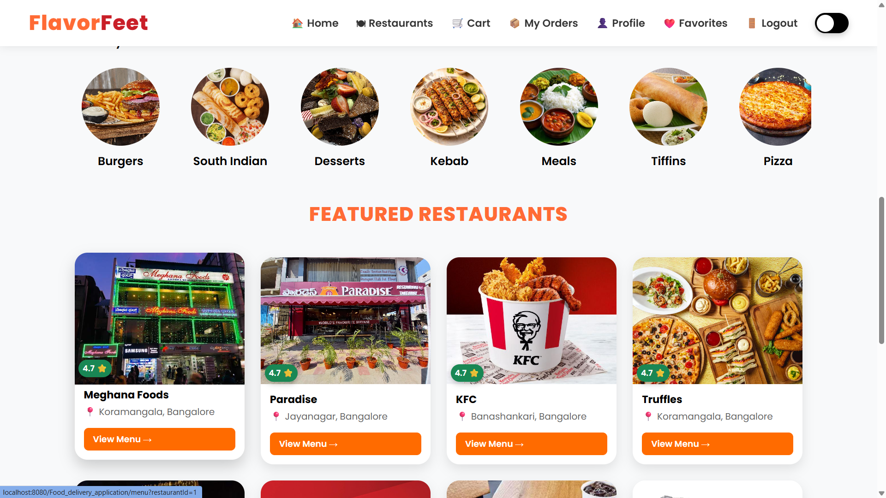
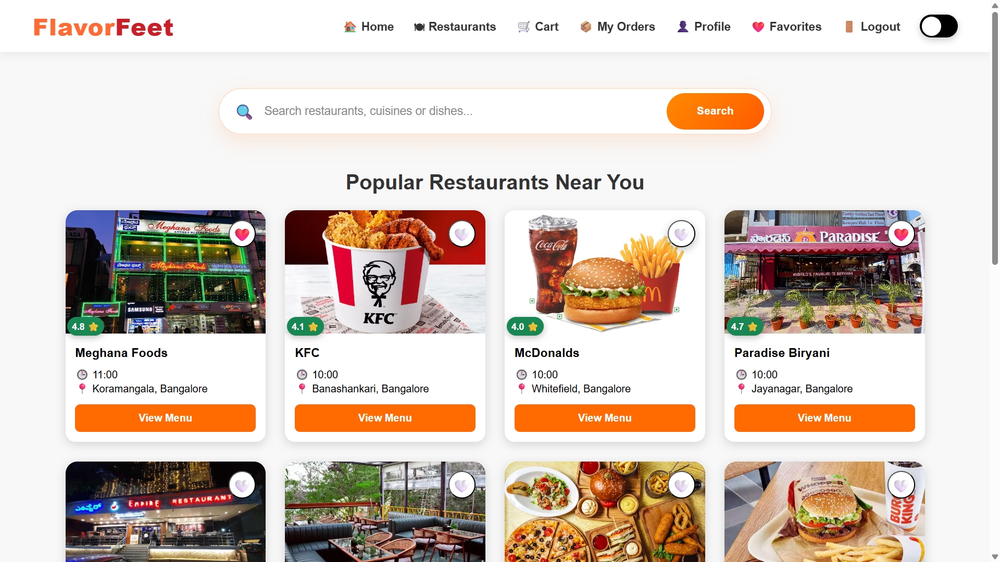
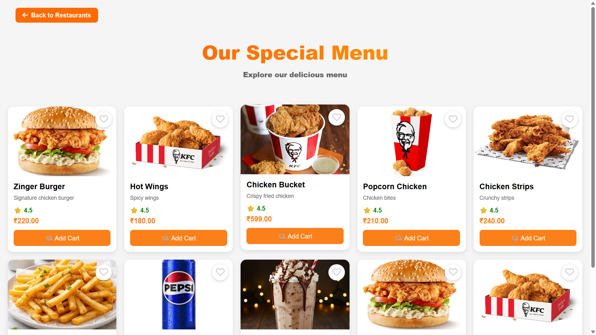
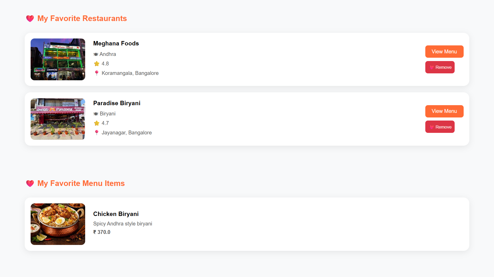
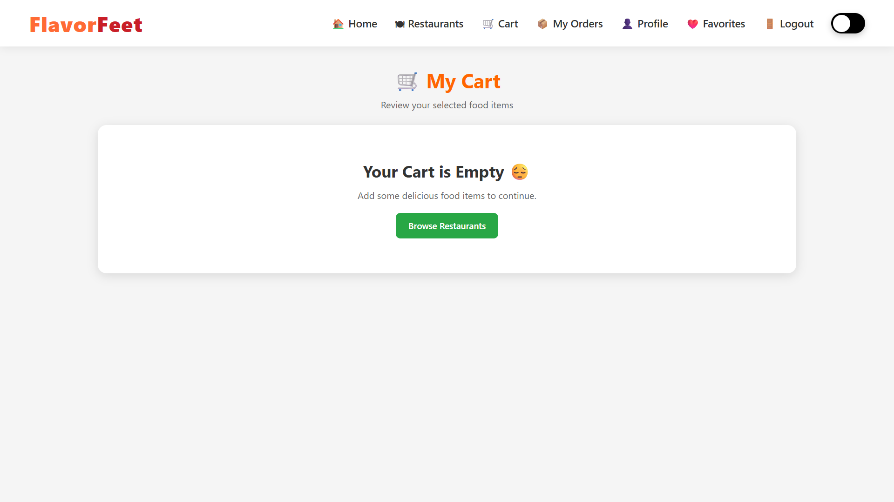
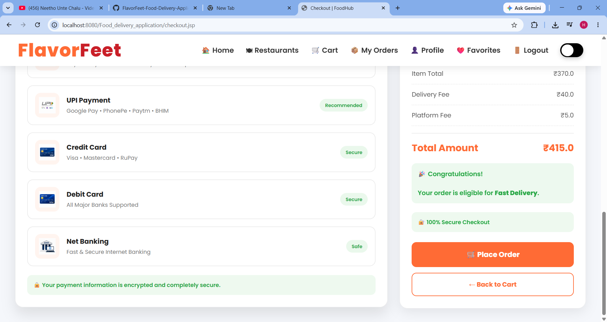

## FlavorFeet-Food-Delivery-Application

## 📌 Project Overview
A full-stack food delivery web application built with Java, JSP, Servlets, JDBC, MySQL, HTML, CSS, and JavaScript, featuring customer and admin modules, favorites, cart, order management, and MVC architecture.


## ❓ Problem Statement

Traditional food ordering often requires customers to visit restaurants or rely on inefficient ordering methods, leading to long waiting times, order errors, and limited convenience. Many small and medium-sized restaurants also lack an efficient digital platform to manage menus, customers, and orders.

FlavorFeet addresses these challenges by providing a full-stack online food delivery system where customers can easily browse restaurants, explore menus, place orders, manage favorites, and track their order history. At the same time, administrators can efficiently manage restaurants, menu items, customers, and orders through a secure admin dashboard, ensuring a seamless and organized food ordering experience.

## ✨ Features

## 👤 Customer Module

- 👥 User Registration and Login
- 🍽️ Browse Restaurants
- 📋 View Restaurant Menus
- 🔍 Search Restaurants
- 🛒 Add Items to Cart
- ➕ Update Cart Quantity
- 🍕 Place Food Orders
- 📦 Order History
- 📄 View Order Details
- ❤️ Favorite Restaurants
- ⭐ Favorite Menu Items
- 👤 User Profile Management
- 🌙 Light & Dark Mode
- 📱 Responsive User Interface

## 👨‍💼 Admin Module

- 🔐 Secure Admin Login
- 📊 Dashboard Overview
- 🏪 Manage Restaurants (Add, Update, Delete)
- 🍔 Manage Menu Items
- 👥 Manage Customers
- 📦 View and Manage Orders
- 🚚 Update Order Status (Placed, Preparing, Out for Delivery, Delivered, Cancelled)

## 🛠️ Technical Features

- ☕ Java Servlets and JSP Architecture
- 🗄️ MySQL Database Integration
- 🔒 Session Management
- 🔌 JDBC Connectivity
- 🏗️ MVC-Based Project Structure
- 📱 Responsive Design
- 🖼️ Image Support for Restaurants and Menu Items
- ⚡ Dynamic Data Rendering
- ✅ Form Validation
- 🎨 Clean and User-Friendly Interface


## 🛠️ Tech Stack

| Category                 | Technologies                 |
| ------------------------ | ---------------------------- |
| **Programming Language** | Java                         |
| **Frontend**             | HTML5, CSS3, JavaScript, JSP |
| **Backend**              | Java Servlets, JDBC          |
| **Database**             | MySQL                        |
| **Architecture Pattern** | MVC (Model–View–Controller)  |
| **Web Server**           | Apache Tomcat 10             |
| **IDE**                  | Eclipse IDE                  |
| **Database Tool**        | MySQL Workbench              |
| **Version Control**      | Git                          |
| **Code Hosting**         | GitHub                       |
| **Libraries**            | MySQL Connector/J, JSTL      |
| **Build Type**           | Dynamic Web Project          |


## 🏛️ Architecture Pattern

This project is developed using the **Model-View-Controller (MVC)** architecture pattern.

 Model

* JavaBeans (User, Restaurant, Menu, Cart, Order, Favorite)
* DAO (Data Access Object) classes
* MySQL Database

 View

* JSP
* HTML
* CSS
* JavaScript

 Controller

* Java Servlets
* Handles client requests, business logic, and navigation between the View and Model.

 Benefits of MVC

* Separation of concerns
* Better code organization
* Easier maintenance
* Improved scalability
* Reusable components
* Simplified testing and debugging


## 📂 Project Structure

```text
Food_delivery_application/
│
├── src/
│   └── main/
│       ├── java/
│       │   ├── controller/          # Servlets
│       │   ├── dao/                 # DAO Interfaces
│       │   ├── daoimpl/             # DAO Implementations
│       │   ├── model/               # Java Beans / Entities
│       │   └── util/                # Database Connection Utilities
│       │
│       └── webapp/
│           ├── images/              # Project Images
│           ├── videos/              # Demo Videos
│           ├── WEB-INF/             # Deployment Descriptor
│           ├── META-INF/            # Manifest Files
│           ├── *.jsp                # JSP Pages
│           ├── *.html               # HTML Pages
│           ├── *.css                # Stylesheets
│           └── *.js                 # JavaScript Files
│
├── build/
├── README.md
└── pom.xml (if Maven)
```

## Request Flow

```text
User
   │
   ▼
JSP Page (View)
   │
   ▼
Servlet (Controller)
   │
   ▼
DAO Layer
   │
   ▼
MySQL Database
   │
   ▲
DAO Layer
   │
   ▲
Servlet
   │
   ▲
JSP (Response)
```

## 🚀 Installation & Setup

1. Clone the repository
2. Import the project into Eclipse IDE
3. Configure the MySQL database
4. Execute the SQL scripts
5. Update the database credentials
6. Deploy on Apache Tomcat 10
7. Access the application in your browser


## 📸 Project Screenshots

### 🏠 Landing Page


### 🔐 Login Page


### 📝 Register Page


### 🏡 Home Page


### 🏡 Home Page


### 🍽️ Restaurants


### 📋 Menu Page


### ❤️ Favorites


### 🛒 Cart Page


### 💳 Checkout Page



## 🔮 Future Enhancements

- 💳 Online Payment Gateway Integration
- 📍 Live Order Tracking
- 🔔 Email Notifications
- ⭐ Ratings & Reviews
- 🎟️ Coupons & Discounts
- 📱 Mobile Application (Android & iOS)


## 👩‍💻 Developer

**Hemalatha**
- GitHub: https://github.com/hemalathaa7
